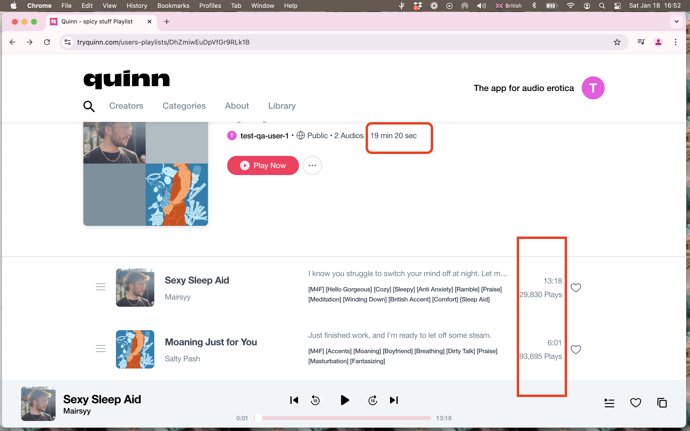
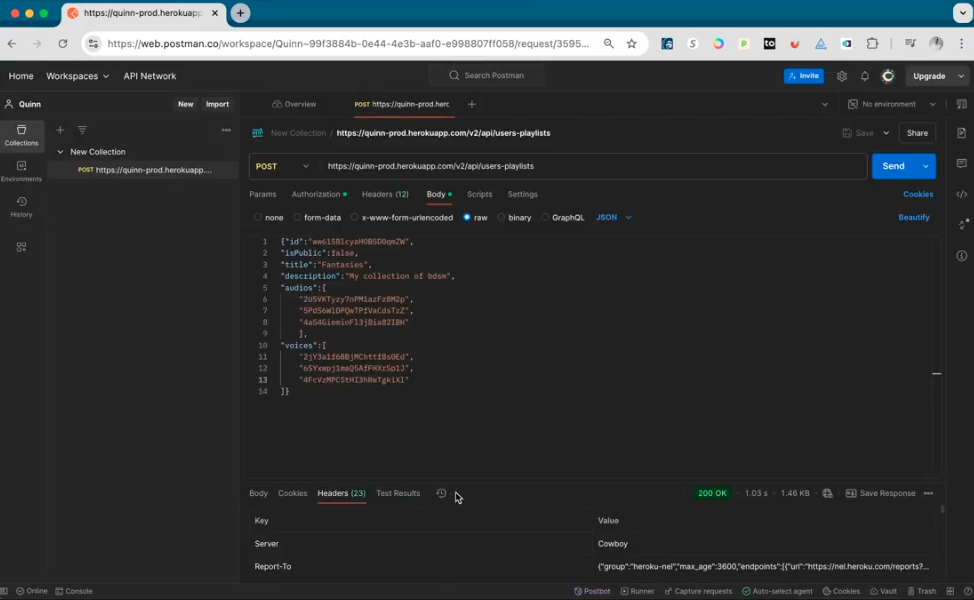
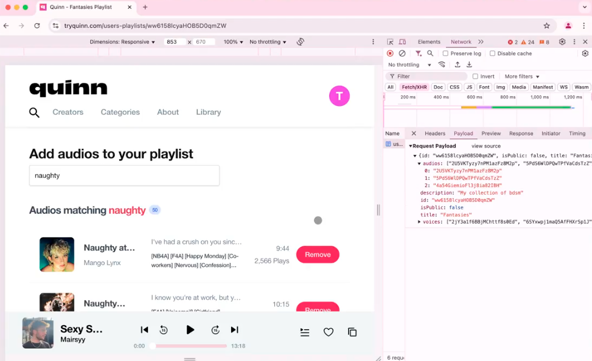

# Playlist Functionality Tests - Chrome & Safari Desktop  

**Ryley Johnson**  
**1/19/2025**  

## Creating a Playlist  
- Successfully created playlists appeared in the **Library** with a default title and were **empty by default**.  
- **No issues observed.**  

## Adding Stories to Playlists  
### Single and Multiple Stories  
- Stories were **added seamlessly**, and the playlist **updated as expected**, with button labels changing from **"Add" to "Remove."**  

### Large Playlists  
- Successfully added **over 100 stories** without any performance issues.  

## Reordering Stories  
- **Stories were reordered smoothly and seamlessly** within playlists, with **no UI glitches or errors**.  

## Classifying Playlists (Public/Private)  
- **Privacy toggles worked accurately across devices**.  
- **Visibility updated immediately** upon making changes.  

## Favoriting Audio  
- **Tested various flows** for favoriting and removing favorites. **No issues observed** with functionality.  
- **Issue Identified:** The **likes count in the Account Overview tab remains at zero** when favoriting individual stories or playlists, despite previous tests indicating these actions should update the count.  
- **Video Evidence:**  
  [Favoriting Issue - Loom Video](https://www.loom.com/share/3cb2e407f1c64af4a857e4946834a093)

## Changing Playlist Title and Description  
### Boundary Testing  
- **Title field:** Accepted **1–25 characters**  
- **Description field:** Accepted **0–512 characters**  
- Both fields **adhered to these boundaries** during typing and copy-pasting.  
- **Tested Inputs:** Numbers, symbols, foreign languages, basic SQL injections.  

### Issues Identified  
- **Title field accepts spaces as valid input**, resulting in **nameless playlists** that are difficult to identify or search for.  
- **Video Evidence:**  
  [Nameless Playlist Issue - Loom Video](https://www.loom.com/share/f0f9ea727585405ab03d7897b7cc7469)

- **Playlist descriptions do not display** on the account holder's playlist screen or when shared with non-users.  
  - **Video Evidence:**  
    [Playlist Description Issue - Loom Video](https://www.loom.com/share/6ec435aa3150412d88e66b4f9e4435c0)
 

## Network Speeds and Offline Behavior  
### Network Speed Testing  
- **Search results loaded in:**  
  - **<500ms** under **fast internet (321 Mbps)**  
  - **~10s** under **slow 3G**  
- **Adding stories took:**  
  - **<500ms** on **fast internet**  
  - **~2s** on **slow 3G**  

### Offline Testing  
- **Adding stories offline showed UI changes but failed to sync with the server after reconnecting**, causing changes to be lost.  
  - **Video Evidence:**  
    [Offline Sync Issue - Loom Video](https://www.loom.com/share/030c06a9de944598a370d763e39eeeed)

## Library Overview Count Mismatch  
- Adding or removing audio stories updates the **playlist header immediately**, but the **Library overview count does not reflect changes until the page is reloaded**.  
  - **Video Evidence:**  
    [Library Count Issue - Loom Video](https://www.loom.com/share/9fc4e87d419645a492e1f998feaeb2d6)

## Favoriting Playlists Count Mismatch  
- **Favoriting playlists adds them to the Library**, but the **playlist count in the My Account section is one less than in the Library overview**.  
  - **Video Evidence:**  
    [Favoriting Count Issue - Loom Video](https://www.loom.com/share/294e3b7049b74c52ac9322f2e710b334)

## Enhancement Suggestion  
- Currently, users **must navigate to a playlist to add stories**.  
- **Suggested Improvement:** Allow users to **add stories to playlists from anywhere in the app** (e.g., browsing categories or profiles).  
  - **Video Evidence:**  
    [Suggested Enhancement - Loom Video](https://www.loom.com/share/90a45f24de6b4880806e27bf7fafca37)

## Playlist Duration Discrepancy  
- The **total duration in the playlist header is consistently one second longer** than the sum of all stories in the playlist.  
- This occurs **even when the playlist contains only a single story**.  
  - **Image Evidence:** 
 

## Postman Demonstration  
- Using **Chrome DevTools Network tab**, I gathered data to send a **POST request** and manipulate playlists.  
- This method **helps validate story additions** while correlating them to their **ID numbers**.  
<h3 align="center">
  <a href="https://drive.google.com/file/d/1x1P3rX1SXoWOy6XNKTylH3VZPthCwoC5/view?usp=sharing">
    Video Evidence: Postman Demo
  </a>
</h3>

  
  

